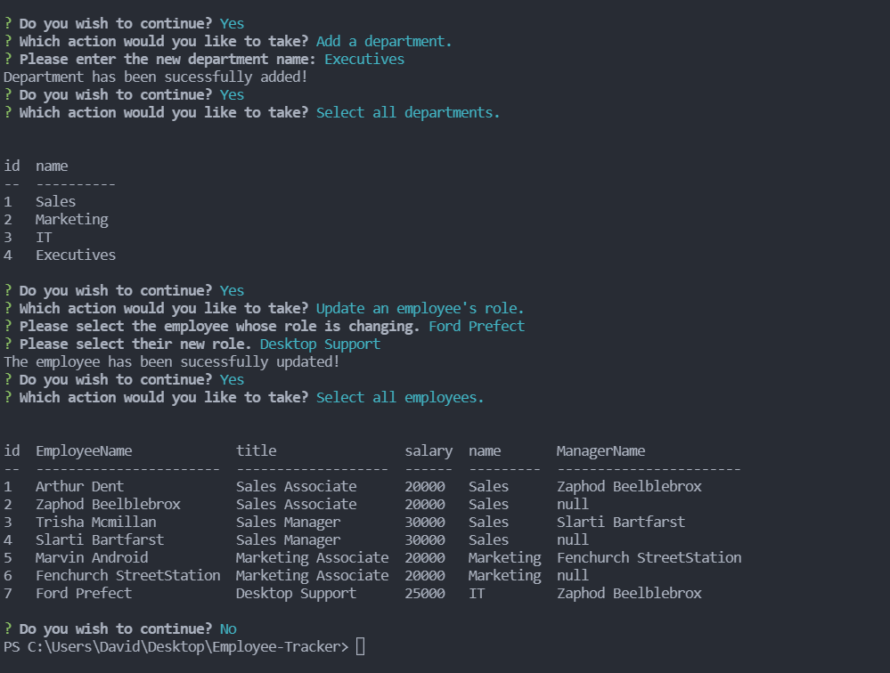

# Employee-Tracker

  [Project Repo](https://github.com/Cleggatron/Employee-Tracker)

  [Video Walkthrough](https://drive.google.com/file/d/1JOcKfg5y11k2pBd9FxXJce7PIijB0VrU/view)

  

  ## Description

  This project will allow someone to manage a group of employees spanning multiple teams and departments. It was a useful exercise in running mysql queries in node.js.

  ## Table Of Contents

  - [Installation](#installation)
  - [Usage](#usage)
  - [Credits](#credits)
  - [License](#license)
  - [Questions](#questions)

  ## Installation

  Once the repo has been cloned you will need to run the command `npm i` in the command line. This will install the necessary dependencies. You will also need to create a .env file at the top level of the file structure. This will need to house the following data: DB_NAME=<database name here>  DB_PASSWORD=<your mysql password here>  DB_USER=<your mysql username here>. Once this is done you will need to naavigate to the db folder. Initialise mysql and run the source and seed files. You will need to update the seed file with your won pre-existing data. 

  ## Usage

  

  Once this has been installed you can start the program running with the command `node index.js`. From there you will recieve a series of prompts to utilise the file. You can also review the video walkthrough at hte top of this readme.

  ## Credits

  Other Contributors: 
  N/A

  Third Party Technologies:
  The Third Party Code used:
 - console.table
 -  inquirer
 -  mysql2
 -  dotenv

  ## License
  MIT License

  [License Link](https://opensource.org/licenses/MIT)

  Copyright <2021> <DAVID CLEGG>

      Permission is hereby granted, free of charge, to any person obtaining a copy of this software and associated documentation files (the "Software"), to deal in the Software without restriction, including without limitation the rights to use, copy, modify, merge, publish, distribute, sublicense, and/or sell copies of the Software, and to permit persons to whom the Software is furnished to do so, subject to the following conditions:
      
      The above copyright notice and this permission notice shall be included in all copies or substantial portions of the Software.
      
      THE SOFTWARE IS PROVIDED "AS IS", WITHOUT WARRANTY OF ANY KIND, EXPRESS OR IMPLIED, INCLUDING BUT NOT LIMITED TO THE WARRANTIES OF MERCHANTABILITY, FITNESS FOR A PARTICULAR PURPOSE AND NONINFRINGEMENT. IN NO EVENT SHALL THE AUTHORS OR COPYRIGHT HOLDERS BE LIABLE FOR ANY CLAIM, DAMAGES OR OTHER LIABILITY, WHETHER IN AN ACTION OF CONTRACT, TORT OR OTHERWISE, ARISING FROM, OUT OF OR IN CONNECTION WITH THE SOFTWARE OR THE USE OR OTHER DEALINGS IN THE SOFTWARE.  

  ## Questions

  If you have any questions you can contact me at the below email address:
  David.Robert.Clegg@gmail.com

  You can also find me at my Github:
  [Github Profile](https://github.com/Cleggatron)

